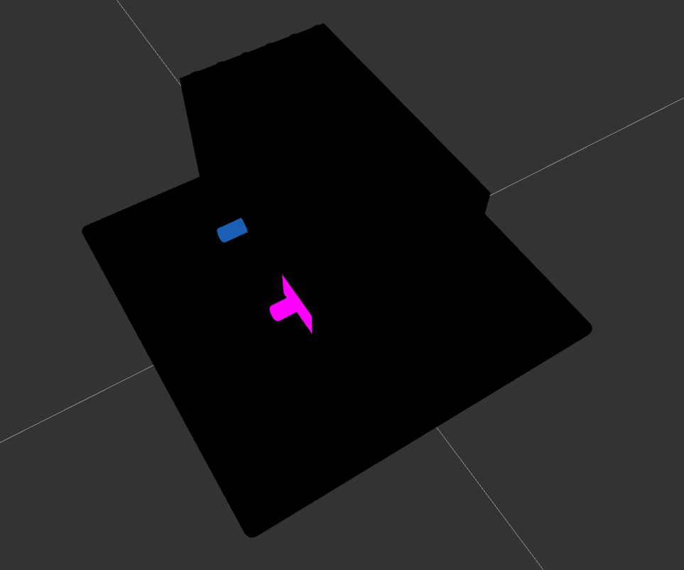

The task involves a Collada file, the first step I took was to open the file in Three.js, an online emulator for 3D designs. Upon loading the file,we got this 

 
I noticed that the box contained two gears, and I decided to change the view to wireframe to better understand the structure of the model.

 

 

By switching to wireframe view, I was able to see the box's internal structure more clearly and identify the gears. I then proceeded to dismantle the box by removing each Lego piece in the body one by one until the gears were the only components remaining. This process allowed me to focus solely on the gears.

To go into further detail, a Collada file is a type of 3D model file format that is used to represent 3D graphics in a variety of applications. Three.js is a JavaScript library that provides a simple way to create and display 3D graphics on the web. By using Three.js to load the Collada file, I was able to easily manipulate and explore the 3D model, including changing the view to wireframe mode to see the model's internal structure.

After dismantling the box by removing each Lego piece by piece we arrived at this.

