# Challenges Solved
## Reverse Engineering
-      VM0 (100 points)
-      Ready Gladiator 0 (100 points)
-      Ready Gladiator 1 (200 points)
-      Ready Gladiator 2 (400 points)
-      Reverse (100 points)
-      Safe Opener 2 (100 points)
-      timer (100 points)
-      No way out (200 points)


## Cryptography
-      Power analysis: warmup (200 points)
-      Power analysis: 1 (400 points)
-      Power analysis: 2 (500 points)
-      SRA (400 points)


# REVERSE ENGINEERING
## VM0 (100 points)
<hr>

<p>The task involves a Collada file, the first step I took was to open the file in Three.js, an online emulator for 3D designs. Upon loading the file,we got this </p>
<hr>


 <p>I noticed that the box contained two gears, and I decided to change the view to wireframe to better understand the structure of the model.</p>
 <hr>

 

<p>By switching to wireframe view, I was able to see the box's internal structure more clearly and identify the gears. I then proceeded to dismantle the box by removing each Lego piece in the body one by one until the gears were the only components remaining. This process allowed me to focus solely on the gears.
</p>
<hr>


<p>To go into further detail, a Collada file is a type of 3D model file format that is used to represent 3D graphics in a variety of applications. Three.js is a JavaScript library that provides a simple way to create and display 3D graphics on the web. By using Three.js to load the Collada file, I was able to easily manipulate and explore the 3D model, including changing the view to wireframe mode to see the model's internal structure.</p>

<p>After dismantling the box by removing each Lego piece by piece we arrived at this.</p>
<hr>

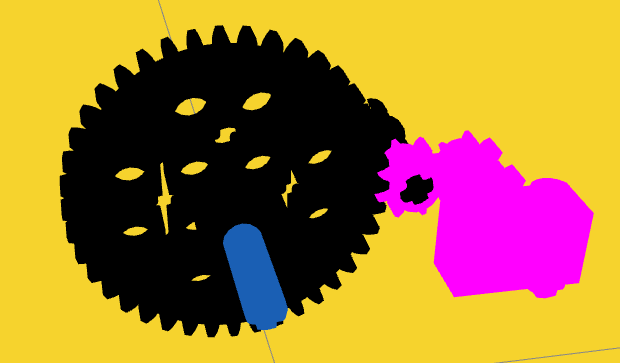

The driver gear (the bigger one) has 40 teeths, while the driven gear (the smaller one) has 8 teeths. So, if the driver gear makes 1 rotation, the driven gear will make 5 rotations. If you recall we have an input we got from the file we downloaded from the task description.

```
┌──(bl4ck4non㉿bl4ck4non)-[~/Downloads/CTF/picoCTF_2023/rev_eng]
└─$ ls
input.txt
                                                                                                                                                                                                
┌──(bl4ck4non㉿bl4ck4non)-[~/Downloads/CTF/picoCTF_2023/rev_eng]
└─$ cat input.txt 
39722847074734820757600524178581224432297292490103996086521425478666370329 
```
So, if the input is the number of rotations the driver gear this means the driven gear will make 5 times the rotation of the driver gear. This means the driven gear will make ```198614235373674103788002620892906122161486462450519980432607127393331851645``` number of rotations. This number of rotations for the driven gear is actually encoded. Interesting right?😎

Lets decode this from Decimal to Hex


Then we convert from Hexadecimal to Text


cool, we got our flag

------------------------------

## Ready Gladiator 0 (100 points)
<hr>

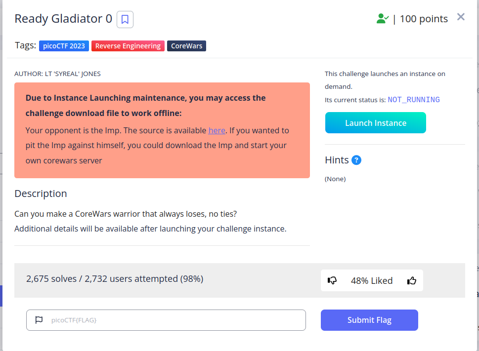

<p>This challange is about the CodeWars warriror, in this task they need us to make a warrior that always loses with not ties</p>

<p>Simple solution was to send `end` to the terminal after connecting to the instance throws us back our flag!! (<_>)</p>
<hr>

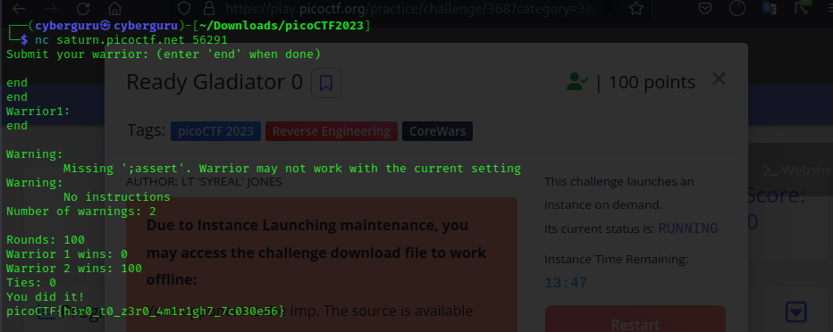


## Ready Gladiator 2 (400 points)
<hr>

This challenge focuses on wining every round in a CoreWars game, So the plan is to find a suitable strategy to make our warrior win every round in the game

One of the ways is the use a Bomber script. A bomber randomly drops complex bombs designed to damage or stun the opponent. So i found this blog online that has multiple strategies of wining an imp game

Link: https://corewar.co.uk/strategy.htm


tips for winning every round in an imp game

So i tried this particular bomber to test if i can win all the rounds, because the script looks simple and short. Here is the link below 

Link: https://corewar.co.uk/heremscimitar.htm

Copy the code from the site and paste it into your imp.red file. 

```
┌──(bl4ck4non㉿bl4ck4non)-[~/Downloads/CTF/picoCTF_2023/rev_eng]
└─$ nano imp.red
                                                                                                                                                                                                
┌──(bl4ck4non㉿bl4ck4non)-[~/Downloads/CTF/picoCTF_2023/rev_eng]
└─$ cat imp.red  
;redcode-94
;name Herem/Scimitar
;author A.Ivner,P.Kline
;strategy bomber
;macro
step     equ   27
count    equ   1470

         jmp   clr
start    mov   sb,@st
st       mov   {100,cnt-(2count*step)-1
         add   bmb,st
cnt      djn   start,#count-1
sb       spl   #step,0
clr      mov   bmb,>-13
         djn.f clr,{-14
  for 22
         dat   0,0
  rof
         dat   <4,step+step
bmb      dat   <4,step+step
            start
end
```
Run the imp file against the server using the nc listener provided by PicoCTF

>command:```nc saturn.picoctf.net 64120 < imp.red```

```
┌──(bl4ck4non㉿bl4ck4non)-[~/Downloads/CTF/picoCTF_2023/rev_eng]
└─$ nc saturn.picoctf.net 64120 < imp.red
;redcode-94
;name Herem/Scimitar
;author A.Ivner,P.Kline
;strategy bomber
;macro
step     equ   27
count    equ   1470

         jmp   clr
start    mov   sb,@st
st       mov   {100,cnt-(2count*step)-1
         add   bmb,st
cnt      djn   start,#count-1
sb       spl   #step,0
clr      mov   bmb,>-13
         djn.f clr,{-14
  for 22
         dat   0,0
  rof
         dat   <4,step+step
bmb      dat   <4,step+step
            start
end
Submit your warrior: (enter 'end' when done)

Warrior1:
;redcode-94
;name Herem/Scimitar
;author A.Ivner,P.Kline
;strategy bomber
;macro
step     equ   27
count    equ   1470

         jmp   clr
start    mov   sb,@st
st       mov   {100,cnt-(2count*step)-1
         add   bmb,st
cnt      djn   start,#count-1
sb       spl   #step,0
clr      mov   bmb,>-13
         djn.f clr,{-14
  for 22
         dat   0,0
  rof
         dat   <4,step+step
bmb      dat   <4,step+step
            start
end

Warning in line 22: '            start'
        Ignored, redefinition of label 'start'
Warning:
        Missing ';assert'. Warrior may not work with the current setting
Number of warnings: 2

Rounds: 100
Warrior 1 wins: 100
Warrior 2 wins: 0
Ties: 0
You did it!
picoCTF{d3m0n_3xpung3r_ed173f56}
```
cool, we got our flag


## Ready Gladiator 1 (200 points)
<hr>

We use thesame code as ready gladiator 2 to solve this challenge since the solution need's it to get atleast one win which the code has

## Reverse (100 points)
<hr>

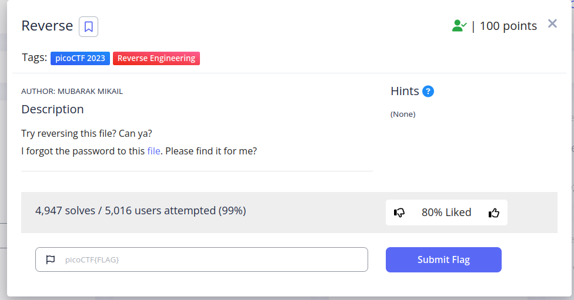

<p>This was a basic reverse engineering challenge, as usual runing strings on the file and greping for keyword `pico` gave us the flag!! (<_>)</p>

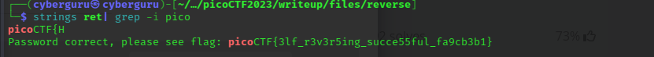

## Safe Opener 2 (100 points)
<hr>

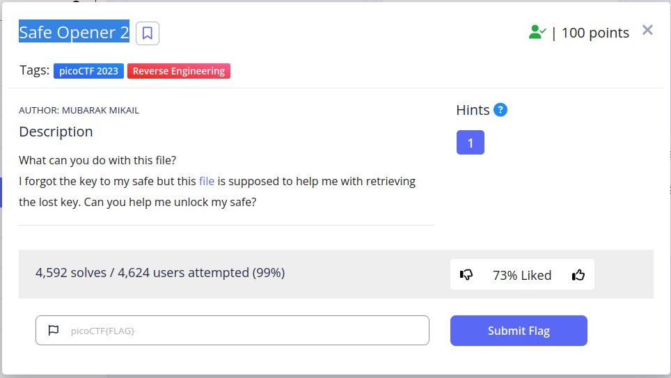

<p>Doing the same operation as the previous challenge we got our flag</p>

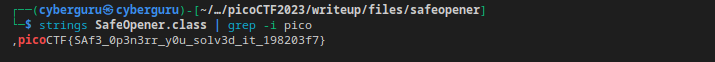

## timer (100 points)
<hr>

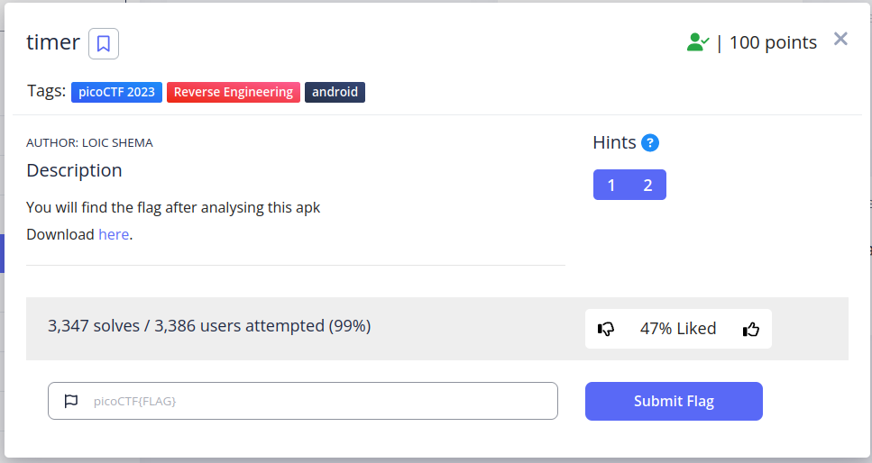

<p>This an andriod challenge, looks simillar to the apk series in the picoGym, first thing was to unpack the apk file downloaded with <p>

## No way out (200 points)
<hr>

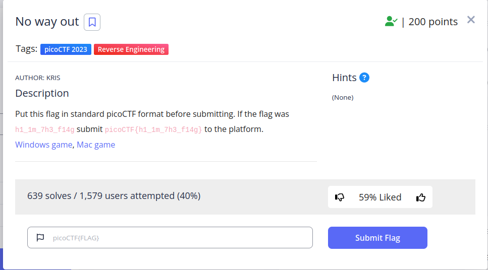

Finaly!!, some 3D action game for reversing, this a 3D game made with Unity, downloading the file from [here](https://artifacts.picoctf.net/c/285/win.zip) and running it we have

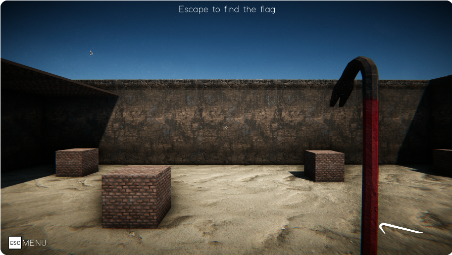

the goal of the challenge is to Escape and get the flag

<p> Upon launching the game and engaging in gameplay, I discovered that the game had limitations within its virtual walls. Despite being able to climb the ladder and view the visually mounted flag, it was unattainable. However, through the use of some tutorials and cheat engine, I was able to manipulate the character's position in both time and space. To achieve this, I initially attached the running game process to the cheat engine. Prior to running the game, it is advisable to follow all tutorials in the cheat engine as it is immensely helpful in identifying and changing parameters during gameplay. Next, I proceeded to locate the player's coordinates, which proved to be a cumbersome task. My technique involved finding the player's y-axis by differentiating between movement levels of high and low altitude values. After several minutes of searching, I was able to determine the player's y-axis. The x, y, and z coordinates are 4 bytes apart in the address register, thus by adding 4 bytes to the y-coordinate, we were able to determine the remaining coordinates, thereby allowing for teleportation to the flag destination without any constraints.After doing so we were greeted with a screen of our flag.</p> 

This is a more similar challenge to what [liveoverflow](https://www.youtube.com/watch?v=yAl_6qg6ZnA) once solved


# Cryptography

## Power analysis: warmup (200 points)
<hr>

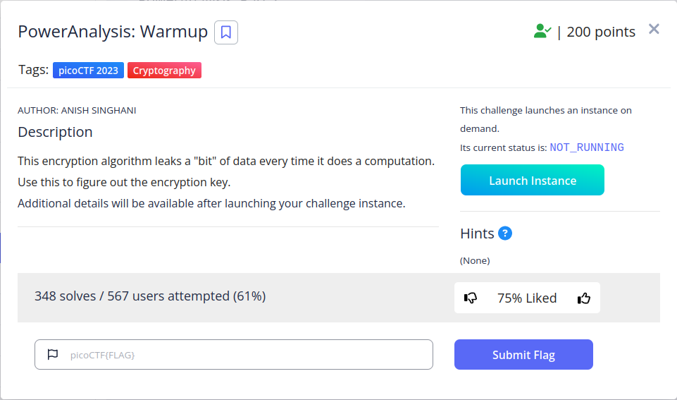

This challenge is one of the famous side channel attacks out there, but this has to do with AES, starting the instance of the challenge, we see a file, downloading it and on opening we get

```
#!/usr/bin/env python3
import random, sys, time

with open("key.txt", "r") as f:
    SECRET_KEY = bytes.fromhex(f.read().strip())

Sbox = (
    0x63, 0x7C, 0x77, 0x7B, 0xF2, 0x6B, 0x6F, 0xC5, 0x30, 0x01, 0x67, 0x2B, 0xFE, 0xD7, 0xAB, 0x76,
    0xCA, 0x82, 0xC9, 0x7D, 0xFA, 0x59, 0x47, 0xF0, 0xAD, 0xD4, 0xA2, 0xAF, 0x9C, 0xA4, 0x72, 0xC0,
    0xB7, 0xFD, 0x93, 0x26, 0x36, 0x3F, 0xF7, 0xCC, 0x34, 0xA5, 0xE5, 0xF1, 0x71, 0xD8, 0x31, 0x15,
    0x04, 0xC7, 0x23, 0xC3, 0x18, 0x96, 0x05, 0x9A, 0x07, 0x12, 0x80, 0xE2, 0xEB, 0x27, 0xB2, 0x75,
    0x09, 0x83, 0x2C, 0x1A, 0x1B, 0x6E, 0x5A, 0xA0, 0x52, 0x3B, 0xD6, 0xB3, 0x29, 0xE3, 0x2F, 0x84,
    0x53, 0xD1, 0x00, 0xED, 0x20, 0xFC, 0xB1, 0x5B, 0x6A, 0xCB, 0xBE, 0x39, 0x4A, 0x4C, 0x58, 0xCF,
    0xD0, 0xEF, 0xAA, 0xFB, 0x43, 0x4D, 0x33, 0x85, 0x45, 0xF9, 0x02, 0x7F, 0x50, 0x3C, 0x9F, 0xA8,
    0x51, 0xA3, 0x40, 0x8F, 0x92, 0x9D, 0x38, 0xF5, 0xBC, 0xB6, 0xDA, 0x21, 0x10, 0xFF, 0xF3, 0xD2,
    0xCD, 0x0C, 0x13, 0xEC, 0x5F, 0x97, 0x44, 0x17, 0xC4, 0xA7, 0x7E, 0x3D, 0x64, 0x5D, 0x19, 0x73,
    0x60, 0x81, 0x4F, 0xDC, 0x22, 0x2A, 0x90, 0x88, 0x46, 0xEE, 0xB8, 0x14, 0xDE, 0x5E, 0x0B, 0xDB,
    0xE0, 0x32, 0x3A, 0x0A, 0x49, 0x06, 0x24, 0x5C, 0xC2, 0xD3, 0xAC, 0x62, 0x91, 0x95, 0xE4, 0x79,
    0xE7, 0xC8, 0x37, 0x6D, 0x8D, 0xD5, 0x4E, 0xA9, 0x6C, 0x56, 0xF4, 0xEA, 0x65, 0x7A, 0xAE, 0x08,
    0xBA, 0x78, 0x25, 0x2E, 0x1C, 0xA6, 0xB4, 0xC6, 0xE8, 0xDD, 0x74, 0x1F, 0x4B, 0xBD, 0x8B, 0x8A,
    0x70, 0x3E, 0xB5, 0x66, 0x48, 0x03, 0xF6, 0x0E, 0x61, 0x35, 0x57, 0xB9, 0x86, 0xC1, 0x1D, 0x9E,
    0xE1, 0xF8, 0x98, 0x11, 0x69, 0xD9, 0x8E, 0x94, 0x9B, 0x1E, 0x87, 0xE9, 0xCE, 0x55, 0x28, 0xDF,
    0x8C, 0xA1, 0x89, 0x0D, 0xBF, 0xE6, 0x42, 0x68, 0x41, 0x99, 0x2D, 0x0F, 0xB0, 0x54, 0xBB, 0x16,
)

# Leaks one bit of information every operation
leak_buf = []
def leaky_aes_secret(data_byte, key_byte):
    out = Sbox[data_byte ^ key_byte]
    leak_buf.append(out & 0x01)
    return out

# Simplified version of AES with only a single encryption stage
def encrypt(plaintext, key):
    global leak_buf
    leak_buf = []
    ciphertext = [leaky_aes_secret(plaintext[i], key[i]) for i in range(16)]
    return ciphertext

# Leak the number of 1 bits in the lowest bit of every SBox output
def encrypt_and_leak(plaintext):
    ciphertext = encrypt(plaintext, SECRET_KEY)
    ciphertext = None # throw away result
    time.sleep(0.01)
    return leak_buf.count(1)

pt = input("Please provide 16 bytes of plaintext encoded as hex: ")
if len(pt) != 32:
    print("Invalid length")
    sys.exit(0)

pt = bytes.fromhex(pt)
print("leakage result:", encrypt_and_leak(pt))

```

This code is written in Python3 and involves reading a secret key from a text file and using it to encrypt data. The Sbox is a substitution table used for encryption. The "with open" statement reads the contents of the "key.txt" file, stripping any white space and converting the resulting string into bytes using the fromhex method. The Sbox is a list of hexadecimal values that will be used for encryption. The code returns the numbers of the last bit obtained from the result of xorring the key with our supplied plaintext which returns a content from the SBOX and print it to us.

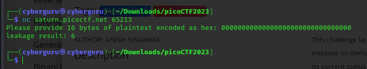

connecting to the server using netcat we got similar output as our assertion was correct, we could see that the output of our lekage result is 6 after supplying 16-byte of zero's. Taking a peak at the hint it mentioned ```The "encryption" algorithm is simple and the correlation between the leakage and the key can be very easily modeled```

using this method i was able to write a [script](../writeup/files/power_analysis/warmup_sol.py) to find the possible key used

```

leak_buf = []
out = []
full = []

flag = ''

for k in range(0, 16):
    out = []
    first,start = True, False
    checkk = False
    teach = True
    third = False
    prev = 0
    h = 0
    j = 0
    try:
        for i in range(0, 256+1):
            pt = hex(bytes_to_long(f"{chr(i)}".encode()))[2:]
            pt = pt + "00"*(15 - k)
            pt = pt.zfill(32)
            val = encryp(pt)
            if val > h:
                h = val
            if first:
                prev = val
            elif (start and teach):
                if val == prev:
                    c = hex(bytes_to_long('c'.encode()))[2:]
                    c = c + '00'*13
                    c = c.zfill(32)
                    check = encryp(c)
                    out.extend([1, 1]) if check <= val  else out.extend([0,0])
                elif val > prev:
                    out.extend([0, 1])
                elif prev > val:
                    out.extend([1, 0])
                start = False
                teach = False
            else:
                if val > prev:
                    out.append(1)
                elif val == prev and (val == h):
                    out.append(1)
                else:
                    out.append(0)
            first = False
            start = True
            j += 1
            prev = val
        ind = list(mapping.values()).index(out)
        f = str(list(mapping.keys())[ind]).zfill(2)
        flag = flag + f
        print("Added: ", f)
        print("+++++++++++++++++Flag:",flag)
        full.append(out)

    except:
        print("failed bit: ")
        print(out)
        full.append(out)
        if out[0] == 0:
            out[0], out[1] = 1,1
        else:
            out[0], out[1] = 0,0
        try:
            ind = list(mapping.values()).index(out)
            flag = flag + list(mapping.keys())[ind]
        except:
            flag = flag +'-'
            continue

print(flag)
assert len(flag) == 32, "not done"
print("Flag bruteforced!!!!!!!!!!!!!!!!!!!!!!!!")
```

<p>  The code uses a for loop to iterate through 16 possible values of k. Within the loop, the code initializes several variables to their initial values, and then attempts to generate a string of binary digits that represents the output of an encryption function. </p>
<p> The code first generates a hex representation of the integer i, which ranges from 0 to 256. It then pads this hex representation with zeros so that it has a length of 32 characters. The resulting string is passed as input to the encryp function, which generates an output value.</p>

<p> The code then checks the output value against several variables, including h, prev, start, teach, and first, to determine how to update the output binary string out. Depending on the values of these variables and the relationship between the current output value and the previous output value, the code appends either a 0 or a 1 to out.</p>

<p> Once the loop over i completes, the code tries to match the binary string out to a pre-defined dictionary called mapping. If a match is found, the corresponding key value is added to the flag string. If a match is not found, the code appends a "-" character to the flag string and continues to the next iteration of the loop over k.</p>

<p> After all 16 iterations over k complete, the final value of the flag string is printed to the console. If the length of the flag is not exactly 32 characters, an assertion error is raised. Otherwise, a success message is printed to the console.
</p>


## Power analysis: 1 (400 points)
<hr>

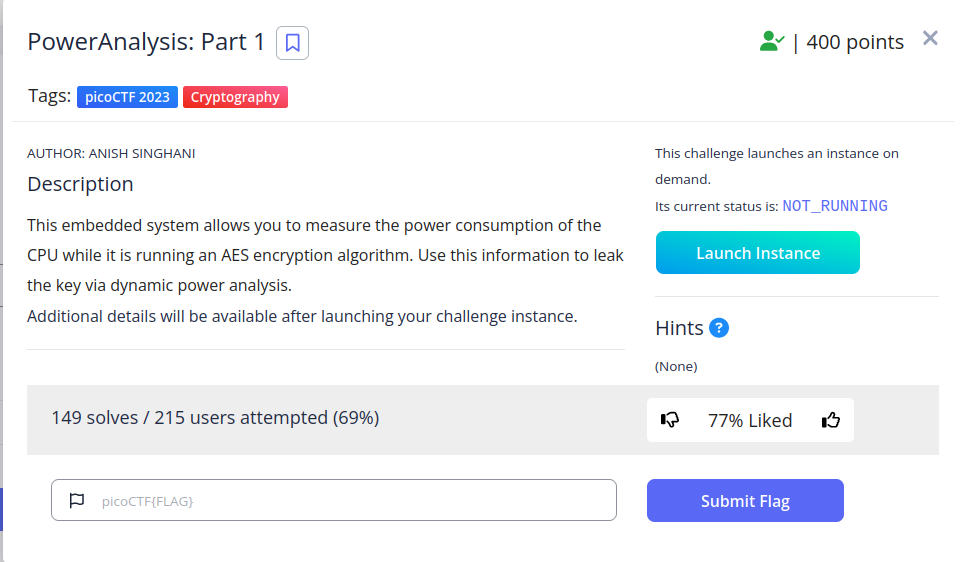

